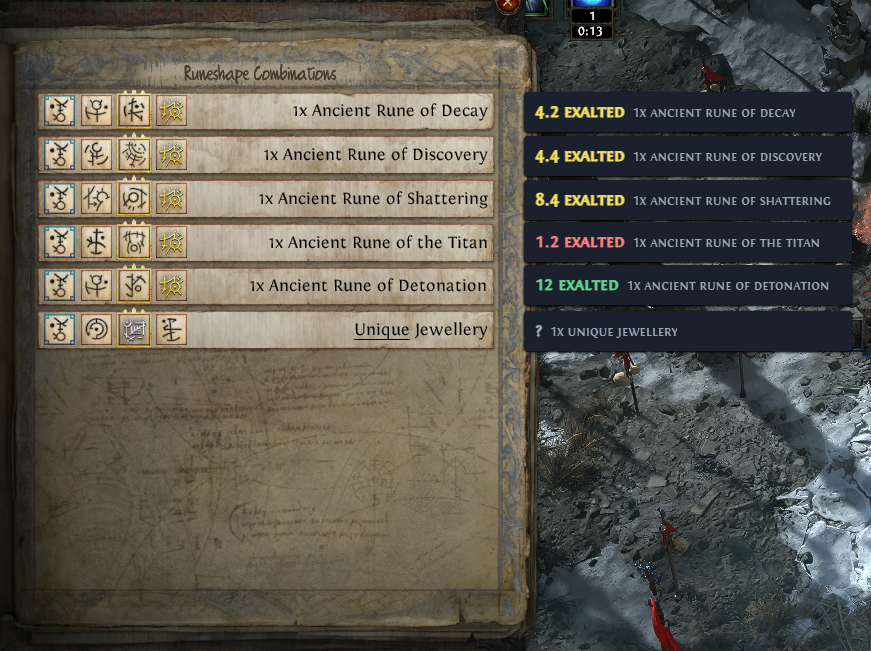
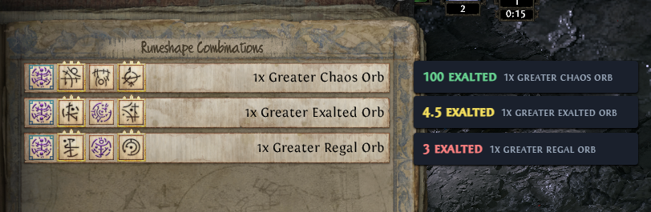
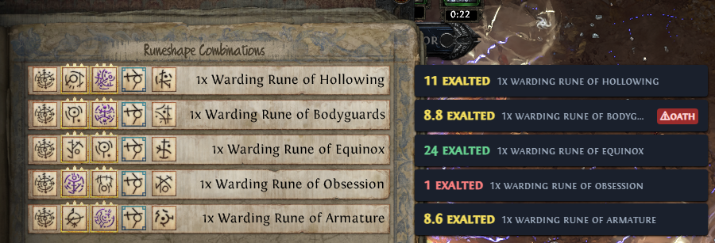
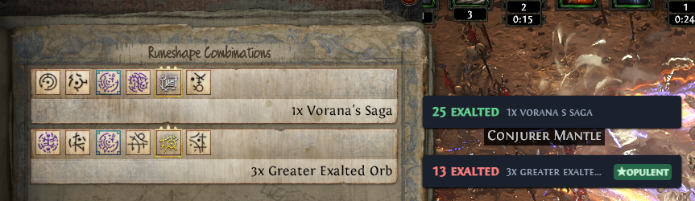
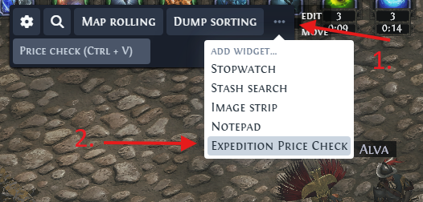
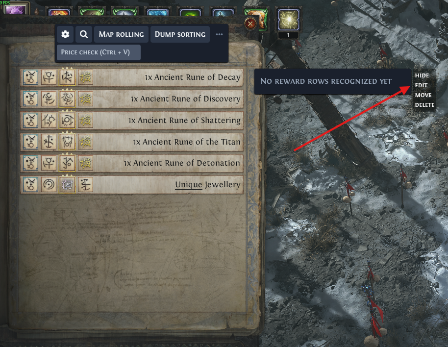

#  Exiled Exchange 2 (personal fork)
**This is a personal fork of [Kvan7/Exiled-Exchange-2](https://github.com/Kvan7/Exiled-Exchange-2),
customized for my own use** — notably an added Expedition Price Check widget that OCRs the Path of
Exile 2 Expedition "Runeshape Combinations" reward panel and shows a live
poe.ninja price next to each reward row.

It adds a price & rune type checker, enabling quick estimation of reward valuation & good/dangerous rune modifiers.

## Expedition Price Check

Reward rows are matched against poe.ninja and priced in the game window, on a
hotkey.

| | | |
| --- | --- | --- |
|  |  |  |

Prices are coloured by rank against the other rows currently on screen — highest
green, lowest red, the rest yellow.

## Rune detection (Experimental, off by default)

An experimental rune detection system attempts to name all runes in each row and will warn about good/dangerous ones. Edit the priority here: [`rune-ratings.json`](./renderer/public/data/expedition/rune-ratings.json).

| | |
| --- | --- |
|  |  |

<!-- Still unpictured: the dimmed marker (rated but not gilded) and the gold
     underline, neither of which appears in the two captures above. The
     underline is covered by image slot 2 below, in a two-line mode. -->

| Marker | Meaning |
| --- | --- |
| Filled red, `⚠` | A rune rated *trap*, detected as gilded. The Oath Rune is the recorded example: additional waves that are immortal until cleared and drop no loot, applied to every later encounter. |
| Filled green, `★` | A rune rated *great*, detected as gilded. The Opulent Rune is the recorded example: increased monster rarity for the remainder of the chain. |
| Dimmed | Rated notable, but not detected as gilded, so it affects the single pick only. |
| Gold underline | A gilded rune, in the two-line display mode, if turned on. |

This function is off by default and experimental.

## Tool showcase

The remainder of the application is the standard Exiled Exchange 2.

| Gem                                                | Rare                                                 | Unique                                                   | Currency                                                     |
| -------------------------------------------------- | ---------------------------------------------------- | -------------------------------------------------------- | ------------------------------------------------------------ |
|  |  |  |  |

Upstream's FAQ: <https://kvan7.github.io/Exiled-Exchange-2/faq>

## Setting up Expedition Price Check

1. In the widget bar, open **⋯** → **Add widget...** → **Expedition Price Check**.

   

2. Hover the widget and click **Edit**.

   

3. Drag the green box over the reward text column of the panel, confirm the
   hotkey (`Shift + M` by default), and **Save**. The default region does not
   match every resolution and UI scale, so this step is required. Keep the region
   tight to the text column: rune rows are recognised only where row height falls
   between 8% and 40% of region width, so an over-wide region yields prices but
   no runes.

   

4. Open a Runeshape Combinations panel in game and press the hotkey.

### Settings

In the widget's settings panel (**Edit**, per step 2).

| Setting | Default | Effect |
| --- | --- | --- |
| Hotkey | `Shift + M` | Runs a single scan of the calibrated region. |
| Region | per-user | The area passed to OCR. Drag the green box, or enter x/y/width/height fractions. |
| Watch for the panel automatically (experimental) | Off | Shows the widget whenever the panel opens, without a keypress. Requires a scan every interval for the whole session. |
| Scan every (seconds) | 3 | Interval between scans while watching for the panel. Clamped to 1–30s. |
| Color-code prices by rank | On | Colours prices by rank among the rows on screen. A single row, or rows tied at one value, show green. |
| Show full names (uncapped width) | On | Permits the widget to widen enough to show the full recognised name, making a misread visible. Off gives a narrower widget. |
| Show raw OCR text (debug) | Off | Lists every unprocessed recognised line below the parsed rows, for diagnosing a layout or matching problem. |
| Track succession runes (experimental) | Off | Enables the rune layer. While off, no rune analysis runs at all. |
| Show (rune detail) | Only runes worth reacting to | How much information about runes is displayed with the price text.

<!-- ### Scan timing

One scan is a full game-window screenshot, cropped to the region and passed to
`Windows.Media.Ocr`. It costs roughly 300 ms, of which about 18 ms is the OCR
engine; the remainder is process startup and marshalling. Measurements and
optimisation options are in
[EXPEDITION_OCR_PERFORMANCE.md](./EXPEDITION_OCR_PERFORMANCE.md).

| State | Scans |
| --- | --- |
| Panel closed, automatic watching off *(default)* | None. No timer runs. |
| Hotkey pressed | One. |
| Panel open | One every 700 ms. |
| Panel closed again | Two to confirm, then scanning stops. |
| Panel closed, automatic watching on | One per interval, for the whole session. |

Only one scan runs at a time; a tick arriving while a scan is outstanding is
skipped. No screenshot or OCR is performed while the game is not the foreground
window. Rune tracking adds per-scan image analysis when enabled. -->

## Scope and known limitations

- **Not the official project, and not distributed.** Build from source — see
  [Development](#development). Official releases are at
  <https://kvan7.github.io/Exiled-Exchange-2/download> and
  <https://github.com/Kvan7/Exiled-Exchange-2/releases>; other sources may be
  malicious.
- **The Expedition features are Windows-only.** They depend on
  `Windows.Media.Ocr`. The rest of the application is unaffected.
- **Rune ratings.** Six runes are rated from community
  write-ups; the rest report as *unrated*. Edit them in
  [`rune-ratings.json`](./renderer/public/data/expedition/rune-ratings.json).
- **Gilding detection is unreliable.** Gilded cells, which propagate modifiers to
  later Remnant encounters, are frequently missed. Classification is by hue, so
  HDR and f.lux may degrade it.
- **English clients only.** Reward text is matched against an English recipe
  table; other locales yield `?` throughout. Border and gilding detection are
  unaffected.
- **`?` marks an unread rune, usually due to some failure** 
- **Rows with no detected cells display no runes.** Prices still resolve.

## Development

Two parts, run in two shells, both of which stay running:

```shell
# Shell 1, from the repo root
cd renderer
npm ci
npm run make-index-files
npm run dev
```

```shell
# Shell 2, from the repo root
cd main
npm ci
npm run dev
```

`main` launches the Electron window once built, and loads the UI from the
`renderer` dev server (`http://localhost:5173`) rather than from built files, so
that server must already be running. Editing `renderer/` hot-reloads; editing
`main/` rebuilds and restarts Electron, which resets in-memory state such as
unsaved widget configuration.

[DEVELOPING.md](./DEVELOPING.md) covers the test suites, formatting, production
builds, releasing, and dependency installation.

The Expedition work has its own notes:

| Doc | Contents |
| --- | --- |
| [EXPEDITION_CHECK.md](./EXPEDITION_CHECK.md) | Architecture of the price check, the layout problem, and constraints on future work. |
| [EXPEDITION_OCR_PERFORMANCE.md](./EXPEDITION_OCR_PERFORMANCE.md) | Where the ~300 ms goes, what has been tried, and the ranked options. |
| [EXPEDITION_RUNE_TRACKING.md](./EXPEDITION_RUNE_TRACKING.md) | Scoping for the rune layer, and the features not yet built. |
| [LOCAL_DIVERGENCE.md](./LOCAL_DIVERGENCE.md) | Every change this fork makes to upstream's files, and the condition under which each stops being needed. Read before merging upstream in. |

## Acknowledgments

- [awakened-poe-trade](https://github.com/SnosMe/awakened-poe-trade)
- [libuiohook](https://github.com/kwhat/libuiohook)
- [RePoE](https://github.com/brather1ng/RePoE)
- [poeprices.info](https://www.poeprices.info/)
- [poe.ninja](https://poe.ninja/)

<!--  -->
